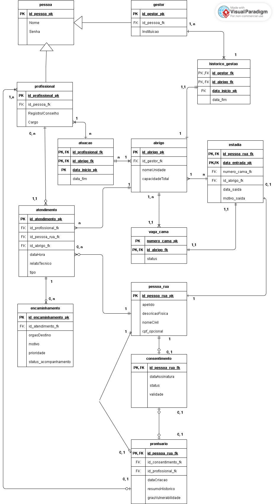
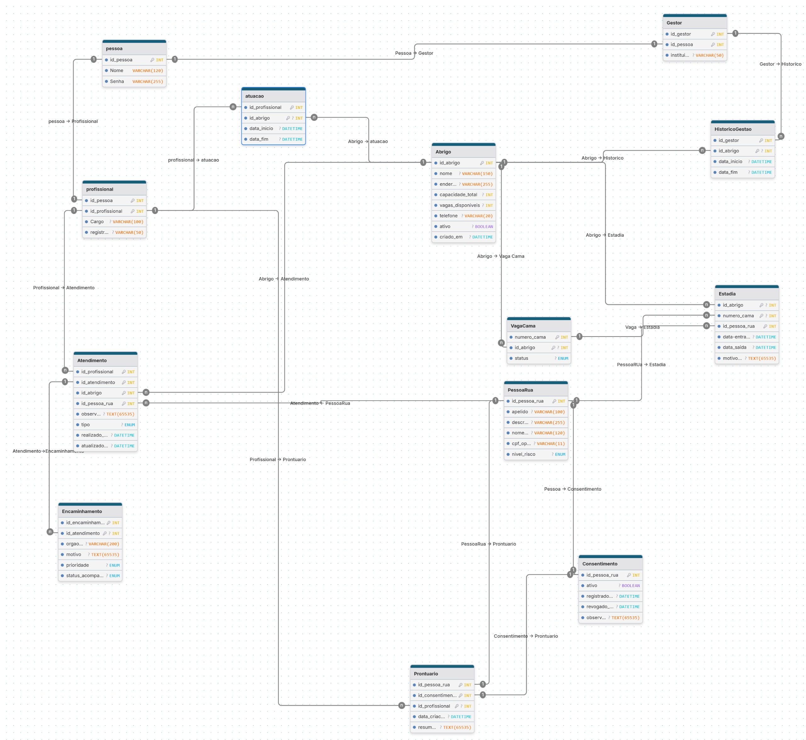

# Shelter Integration Platform

## 👨‍💻 Equipe

| Nome                          | GitHub                                                   |
| ----------------------------- | -------------------------------------------------------- |
| Leôncio Ferreira Flores Neto  | [@LeoncioFerreira](https://github.com/LeoncioFerreira)   |
| Paulo Gabriel Leite Landim    | [@LandimPG](https://github.com/LandimPG)                 |
| Alan Mendes Vieira            | [@alan-mendes-ufca](https://github.com/alan-mendes-ufca) |
| Salomão Rodrigues Silva       | [@salomaosilvaa](https://github.com/salomaosilvaa)       |
| Cícero Jesus da Silva Gomes   | [@cicero-jesus](https://github.com/cicero-jesus)         |
| João Miguel Conrado de Lucena | [@MConras](https://github.com/MConras)                   |

---

## 📌 Divisão de Responsabilidades

| Integrante                    | Endpoints                    | Tabelas            |
| ----------------------------- | ---------------------------- | ------------------ |
| Leôncio Ferreira Flores Neto  | `PessoaRua`, `Pessoa`        | —                  |
| Paulo Gabriel Leite Landim    | `Consentimento`              | `gestor`           |
| Alan Mendes Vieira            | `Atendimento`                | `atuacao`          |
| Salomão Rodrigues Silva       | `Prontuario`, `Profissional` | `estadia`          |
| Cícero Jesus da Silva Gomes   | `Abrigo`, `Vaga`             | —                  |
| João Miguel Conrado de Lucena | `Encaminhamento`             | `historico_gestao` |

> Observação: A tabela acima representa as áreas de maior contribuição de cada integrante.  
> Além disso, quem implementa um endpoint também é responsável pela criação da tabela correspondente.  
> Já os integrantes listados apenas na coluna de tabelas contribuíram exclusivamente com a modelagem e criação dessas estruturas no banco de dados.

---

## 🗄️ Modelagem do Banco de Dados

A modelagem passou por uma revisão entre a versão inicial (DER conceitual) e a versão final implementada (DER lógico). As mudanças refletem decisões de implementação, adequação ao banco relacional e alinhamento com as regras de negócio do sistema.

📚 Documentação completa do projeto: [Wiki do GitLab](https://gitlab.com/ufca/cct/es-bd-2025-2/grupo04/-/wikis/home)

### DER Antigo (Conceitual)

> Versão inicial do modelo, produzida na fase de planejamento.



### DER Novo (Lógico — implementado)

> Versão final, refletindo o schema real do banco de dados.



### 🔄 Mudanças entre os modelos

| Tabela / Campo                            | DER Antigo                                                      | DER Novo                                                                                              | Motivo                                                                                                                                                                                                                                           |
| ----------------------------------------- | --------------------------------------------------------------- | ----------------------------------------------------------------------------------------------------- | ------------------------------------------------------------------------------------------------------------------------------------------------------------------------------------------------------------------------------------------------ |
| `consentimento`                           | Campos: `dataAssinatura`, `status`, `validade`                  | Campos: `ativo` (BOOLEAN), `registrado_em`, `revogado_em`, `observacao`                               | Modelo novo reflete melhor o fluxo LGPD — revogação explícita com data e observação                                                                                                                                                              |
| `prontuario`                              | Tinha `id_consentimento_fk` e `grauVulnerabilidade`             | Sem `id_consentimento_fk`, sem `grauVulnerabilidade`                                                  | O vínculo com consentimento já é garantido via `id_pessoa_rua`, que é PK compartilhada com `consentimento`; `grauVulnerabilidade` foi migrado para `nivel_risco` em `pessoa_rua`, pois o risco é uma característica da pessoa, não do prontuário |
| `pessoa_rua`                              | Sem `nivel_risco`                                               | Com `nivel_risco` (ENUM: baixo/medio/alto/critico)                                                    | Campo adicionado para substituir `grauVulnerabilidade` do prontuário                                                                                                                                                                             |
| `vaga` (antigo) → `vaga_cama` + `estadia` | Tabela única `vaga` com entrada/saída                           | Separada em `vaga_cama` (inventário de camas) e `estadia` (ocupação)                                  | Permite rastrear cama individual, histórico de ocupação e motivo de saída                                                                                                                                                                        |
| `abrigo`                                  | Campos: `nomeUnidade`, `capacidadeTotal`, sem controle de vagas | Campos: `nome`, `endereco`, `capacidade_total`, `vagas_disponiveis`, `telefone`, `ativo`, `criado_em` | Modelo operacional mais completo com controle de disponibilidade em tempo real                                                                                                                                                                   |
| `atendimento`                             | Campos: `dataHora`, `relatoTecnico`                             | Campos: `realizado_em`, `atualizado_em`, `observacoes`                                                | Renomeação para padrão snake_case e separação de data de criação e atualização                                                                                                                                                                   |
| `encaminhamento`                          | PK: `id_encaminhamento_pk`                                      | PK: `id_encaminhamento_pk` (sem mudança estrutural)                                                   | Campos mantidos: `orgaoDestino`, `motivo`, `prioridade`, `status_acompanhamento`                                                                                                                                                                 |
| `historico_gestao`                        | Ligava `gestor` ↔ `abrigo` com período                          | Mantida com `id_gestor`, `id_abrigo`, `data_inicio`, `data_fim`                                       | Sem mudança estrutural — apenas alinhamento de nomes                                                                                                                                                                                             |

---

## 📁 Estrutura do Projeto

```
shelter-integration-platform/
│
├── app/
│   ├── __init__.py                      # Application Factory (create_app)
│   │
│   ├── controllers/                     # Blueprints — rotas de cada membro
│   │   ├── __init__.py
│   │   ├── pessoa_controller.py         # Leôncio
│   │   ├── consentimento_controller.py  # Paulo
│   │   ├── atendimento_controller.py    # Alan
│   │   ├── prontuario_controller.py     # Salomão
│   │   ├── profissional_controller.py   # Salomão
│   │   ├── abrigo_controller.py         # CJ
│   │   ├── vaga_controller.py           # CJ
│   │   └── encaminhamento_controller.py # Miguel
│   │
│   ├── models/                          # Conexão com banco + regras de negócio
│   │   ├── __init__.py
│   │   ├── pessoa_model.py              # Leôncio
│   │   ├── consentimento_model.py       # Paulo
│   │   ├── atendimento_model.py         # Alan
│   │   ├── prontuario_model.py          # Salomão
│   │   ├── profissional_model.py        # Salomão
│   │   ├── abrigo_model.py              # CJ
│   │   ├── vaga_model.py                # CJ
│   │   └── encaminhamento_model.py      # Miguel
│   │
│   └── database.py                      # Configuração da conexão com o banco
│
├── infra/
│   └── sql/
│       ├── 001_create_tables.sql        # Schema principal
│       ├── 002_drop_tables.sql          # Reset do banco
│       └── 003_seed_test_data.sql       # Dados de teste
│
├── docs/
│   ├── der-antigo.png                   # DER conceitual (versão inicial)
│   └── der-novo.png                     # DER lógico (versão implementada)
│
├── .env                                 # Variáveis de ambiente (não versionar!)
├── .env.example                         # Modelo do .env para a equipe
├── .gitignore
├── pyproject.toml
├── Makefile                             # Atalhos para comandos comuns
├── run.py                               # Ponto de entrada da aplicação
└── README.md
```

---

## 📖 Swagger / Documentação da API

A aplicação expõe documentação interativa via Swagger UI:

- **UI:** `/docs/`
- **Spec JSON:** `/openapi.json`

A spec cobre os blueprints já registrados em `create_app()` e descreve o contrato esperado dos endpoints. Enquanto parte da API ainda retorna `501 Endpoint não implementado`, a documentação já serve como referência única para frontend, testes e evolução dos controllers.

---

## 🚀 Como Executar o Projeto

### Pré-requisitos

- Docker e Docker Compose instalados
- Python 3.12+
- `uv` instalado

### 1. Configurar ambiente

```bash
make setup
```

Instala dependências e hooks de pre-commit.

### 2. Subir API com banco

```bash
make run
```

O comando:

- Sobe o container MySQL
- Aguarda o banco aceitar conexões
- Carrega o schema SQL
- Inicia a API Flask em http://127.0.0.1:5000

### 3. Popular banco com dados de teste

O `make run` já popula o banco automaticamente — ao subir a aplicação, as tabelas são criadas e os dados de exemplo são inseridos.

Caso queira resetar os dados manualmente sem subir a API:

```bash
make servicesUp && make servicesWaitDatabase && make servicesLoadDatabase
```

### 4. Executar testes

```bash
make test
```

Para modo watch:

```bash
make testWatch
```

Se quiser API e watch ao mesmo tempo, use dois terminais:

1. Terminal 1: `make run`
2. Terminal 2: `make testWatch`
